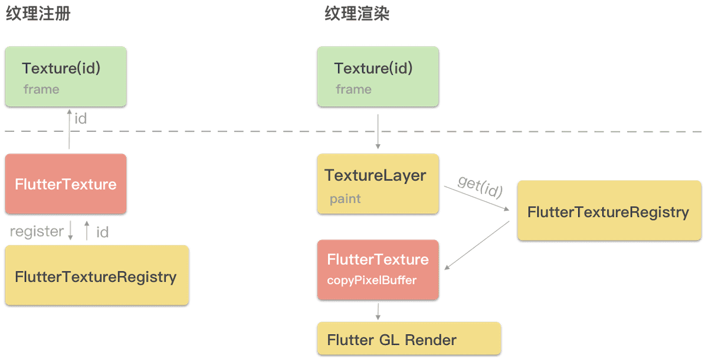

## 基础知识
本文主要介绍视频云 SDK 的点播播放功能，在此之前，先了解如下一些基本知识会大有裨益：

- **直播和点播**
直播（LIVE）的视频源是主播实时推送的。因此，主播停止推送后，播放端的画面也会随即停止，而且由于是实时直播，所以播放器在播直播 URL 的时候是没有进度条的。

 点播（VOD）的视频源是云端的一个视频文件，只要未被从云端移除，视频就可以随时播放， 播放中您可以通过进度条控制播放位置，腾讯视频和优酷土豆等视频网站上的视频观看就是典型的点播场景。

- **协议的支持**
 通常使用的点播协议如下，现在比较流行的是 HLS（以“http”打头，以“.m3u8”结尾）的点播地址：


## 特别说明
视频云 SDK **不会对播放地址的来源做限制**，即您可以用它来播放腾讯云或非腾讯云的播放地址。但视频云 SDK 中的播放器只支持 FLV 、RTMP 和 HLS（m3u8）三种格式的直播地址，以及 MP4、HLS（m3u8）和 FLV 三种格式的点播地址。

## 对接攻略

### step 1: 创建 Player
视频云 SDK 中的 TXVodPlayer 模块负责实现点播播放功能。对应于 Flutter 是 TXVodPlayerController

```xml
TXVodPlayerController controller = TXVodPlayerController();
await controller.initialize();
```

### step 2: 渲染 View
接下来我们要给播放器的视频画面找个地方来显示，Flutter 系统中使用 Widget 作为基本的界面渲染单位，所以您只需要准备一个 Widget 并调整好布局就可以了。你可以直接使用 TXPlayerVideo 或者继承它来显示，也可以参考源码实现自定义视图。

```dart
  @override
  Widget build(BuildContext context) {
    return Scaffold(
      appBar: AppBar(
        title: const Text('点播'),
      ),
      body: SafeArea(
        child: Column(
          children: [
            Container(
              height: 150,
              color: Colors.black,
              child: Center(
                child: _aspectRatio>0?AspectRatio(
                  aspectRatio: _aspectRatio,
                  child: TXPlayerVideo(controller: _controller),
                ):Container(),
              ),
            ),],
        ),
      ),
    );
  }
```

内部原理上讲，我们了解到flutter提供一种机制，可以将native的纹理共享给flutter来进行渲染，以 iOS 为例，看看官方提供的外接纹理机制究竟是怎样运行的。



图中红色块，是我们自己要编写的native代码，黄色是flutter engine的内部代码逻辑。整体流程分为注册纹理，和整体的纹理渲染逻辑。

### 注册纹理

1. 创建一个对象，实现 `FlutterTexture` 协议，该对象用来管理具体的纹理数据
2. 通过 `FlutterTextureRegistry` 来注册第一步的 `FlutterTexture `对象，获取一个flutter纹理id
3. 将该id通过channel机制传递给dart侧，dart侧就能够通过 `Texture` 这个widget来使用纹理了，参数就是id

### 纹理渲染

1. 创建一个对象，实现 `FlutterTexture` 协议，该对象用来管理具体的纹理数据
2. 通过 `FlutterTextureRegistry` 来注册第一步的 `FlutterTexture `对象，获取一个flutter纹理id
3. 将该id通过channel机制传递给dart侧，dart侧就能够通过 `Texture` 这个widget来使用纹理了，参数就是id
4. flutter engine调用 `copyPixelBuffer` 拿到具体的纹理数据，然后交由底层进行gpu渲染

### step 3: 启动播放
TXVodPlayer 支持两种播放模式，您可以根据需要自行选择。flutter中通过 `TXVodPlayerController` 控制进行播放。
1. 通过 url 方式
```dart
_controller.play("http://1400329073.vod2.myqcloud.com/d62d88a7vodtranscq1400329073/59c68fe75285890800381567412/adp.10.m3u8");
```
2. 通过 fileId 方式
```dart
TXPlayerAuthParams params = TXPlayerAuthParams();
params.appId = appId;
params.fileId = fileId;
_controller.startPlayWithParams(params);
```
在 [媒资管理](https://console.cloud.tencent.com/vod/media) 找到对应的文件。点开后在右侧视频详情中，可以看到 fileId。

通过 fileId 方式播放，播放器会向后台请求真实的播放地址。如果此时网络异常或 fileId 不存在，则会收到`PLAY_ERR_GET_PLAYINFO_FAIL`事件，反之收到`PLAY_EVT_GET_PLAYINFO_SUCC`表示请求成功。

### step 4: 播放控制
```dart
// 调整进度
_controller.seek(_progress-10);
// 暂停播放
_controller.pause();
// 恢复播放
_controller.resume();
```

### step 5: 结束播放

```dart
// 停止播放
_controller.stop();
```

### step 6: 变速播放
点播播放器支持变速播放，通过接口`setRate`设置点播播放速率来完成，支持快速与慢速播放，如0.5X、1.0X、1.2X、2X等。

 ```dart
// 设置1.2倍速播放
_controller.setRate(1.2);
```

### step 7: 预加载
在短视频播放场景中，预加载功能对于流畅的观看体验很有帮助：在观看当前视频的同时，在后台加载即将要播放的下一个视频 URL，这样一来，当用户真正切换到下一个视频时，已经不需要从头开始加载了，而是可以做到立刻播放。

这就是视频播放中无缝切换的背后技术支撑，您可以使用 TXVodPlayerController 中的 isAutoPlay 开关来实现这个功能，具体做法如下：


```dart
// 播放视频 A: 如果将 isAutoPlay 设置为 YES， 那么 startPlay 调用会立刻开始视频的加载和播放
String url_A = "http://1252463788.vod2.myqcloud.com/xxxxx/v.f10.mp4";
await _controller_A.setIsAutoPlay(isAutoPlay: true);
await _controller_A.play(url_A);

// 在播放视频 A 的同时，预加载视频 B，做法是将 isAutoPlay 设置为 false
String url_B = "http://1252463788.vod2.myqcloud.com/xxxxx/v.f20.mp4";
await _controller_B.setIsAutoPlay(isAutoPlay: false);
await _controller_B.play(url_B);
```

等到视频 A 播放结束，自动（或者用户手动切换到）视频 B 时，调用 resume 函数即可实现立刻播放。
```dart
_controller.onPlayerEventBroadcast.listen((event) async {//订阅状态变化
  if(event["event"] == 2006) { //2006对应sdk的PLAY_EVT_PLAY_END,详细请查看iOS或者安卓原生SDK状态码
    await _controller_A.stop();
    await _controller_B.resume();
  }
});
```

### step 8: 贴片广告
autoPlay 还可以用来做贴片广告功能，由于设置了 autoPlay 为 NO 之后，播放器会立刻加载但又不会立刻播放，因此可以在此时展示贴片广告，等广告播放结束，在使用 resume 函数立即开始视频的播放。


### step 9: 多码率文件 [UGC 版本暂不支持]
SDK 支持 hls 的多码率格式，方便用户切换不同码率的播放流。在收到 PLAY_EVT_PLAY_BEGIN 事件后，可以通过下面方法获取多码率数组
```dart
_controller.onPlayerEventBroadcast.listen((event) async {//订阅状态变化
  //debugPrint("= TestTXVodPlayer listen state = ${event.toString()}");
  if(event["event"] == 2003 || event["event"] == 2004) {//2003, 2004对应EVT_RENDER_FIRST_I_FRAME,PLAY_EVT_PLAY_BEGIN, 详细请查看iOS或者安卓原生SDK状态码
    _supportedBitrates = await _controller.getSupportedBitrates();
  }
});
```

在播放过程中，可以随时通过`_controller.setBitrateIndex(int);`切换码率。切换过程中，会重新拉取另一条流的数据，因此会有稍许卡顿。SDK 针对腾讯云的多码率文件做过优化，可以做到切换无卡顿。

## 进度展示

点播进度分为两个指标：**加载进度**和**播放进度**，SDK 目前是以事件通知的方式将这两个进度实时通知出来的。


```dart
_controller.onPlayerEventBroadcast.listen((event) async {//订阅状态变化
  //debugPrint("= TestTXVodPlayer listen state = ${event.toString()}");
  if(event["event"] == 2005) {//2005对应EPLAY_EVT_PLAY_PROGRESS, 详细请查看iOS或者安卓原生SDK状态码
    // 加载进度, 单位是秒
    int duration = event["EVT_PLAYABLE_DURATION"].toInt();
    // 播放进度, 单位是秒
    int progress = event["EVT_PLAY_PROGRESS"].toInt();
    // 视频总长, 单位是秒
    int duration = event["EVT_PLAY_DURATION"].toInt();
    // 可以用于设置时长显示等等
  }
});
```

## 事件监听
除了 PROGRESS 进度信息，SDK 还会通过 onPlayerEventBroadcast（事件通知） 和 onPlayerNetStatusBroadcast（状态反馈）同步给您的应用程序很多其它的信息：

### 1. 播放事件
| 事件 ID               |   数值  |  含义说明                 |   
| :-------------------  |:-------- |  :------------------------ | 
|PLAY_EVT_PLAY_BEGIN    |  2004|  视频播放开始，如果有转菊花什么的这个时候该停了 | 
|PLAY_EVT_PLAY_PROGRESS |  2005|  视频播放进度，会通知当前播放进度、加载进度和总体时长     | 
|PLAY_EVT_PLAY_LOADING	|  2007|  视频播放 loading，如果能够恢复，之后会有 LOADING_END 事件|  
|PLAY_EVT_VOD_LOADING_END	|  2014|  视频播放 loading 结束，视频继续播放|  

### 2. 结束事件
| 事件 ID                 |    数值  |  含义说明                |   
| :-------------------  |:-------- |  :------------------------ | 
|PLAY_EVT_PLAY_END      |  2006|  视频播放结束   | 
|PLAY_ERR_NET_DISCONNECT |  -2301  |  网络断连，且经多次重连亦不能恢复，更多重试请自行重启播放 | 
|PLAY_ERR_HLS_KEY		| -2305 | HLS 解密 key 获取失败 |

### 3. 警告事件
如下的这些事件您可以不用关心，它只是用来告知您 SDK 内部的一些事件。

| 事件 ID                 |    数值  |  含义说明                    |   
| :-------------------  |:-------- |  :------------------------ | 
| PLAY_WARNING_VIDEO_DECODE_FAIL   |  2101  | 当前视频帧解码失败  |
| PLAY_WARNING_AUDIO_DECODE_FAIL   |  2102  | 当前音频帧解码失败  |
| PLAY_WARNING_RECONNECT           |  2103  | 网络断连，已启动自动重连（重连超过三次就直接抛送 PLAY_ERR_NET_DISCONNECT 了）|
| PLAY_WARNING_HW_ACCELERATION_FAIL|  2106  | 硬解启动失败，采用软解   |

### 4. 连接事件
此外还有几个连接服务器的事件，主要用于测定和统计服务器连接时间，您也无需关心：

| 事件 ID                     |    数值  |  含义说明                    |   
| :-----------------------  |:-------- |  :------------------------ | 
| PLAY_EVT_VOD_PLAY_PREPARED     |  2013    | 播放器已准备完成，可以播放     |
| PLAY_EVT_RCV_FIRST_I_FRAME|  2003    | 网络接收到首个可渲染的视频数据包（IDR）  |

### 5. 分辨率事件
以下事件用于获取画面变化信息，您也无需关心：

| 事件 ID                     |    数值  |  含义说明                    |   
| :-----------------------  |:-------- |  :------------------------ | 
| PLAY_EVT_CHANGE_RESOLUTION|  2009    | 视频分辨率改变               |
| PLAY_EVT_CHANGE_ROATION	|  2011    | MP4 视频旋转角度 |


## 视频宽高 
**视频的宽高（分辨率）是多少？**
站在 SDK 的角度，如果只是拿到一个 URL 字符串，它是回答不出这个问题的。要知道视频画面的宽和高各是多少个 pixel，SDK 需要先访问云端服务器，直到加载到能够分析出视频画面大小的信息才行，所以对于视频信息而言，SDK 也只能以通知的方式告知您的应用程序。 

 **onNetStatus** 通知每秒都会被触发一次，目的是实时反馈当前的推流器状态，它就像汽车的仪表盘，可以告知您目前 SDK 内部的一些具体情况，以便您能对当前网络状况和视频信息等有所了解。
  
|   评估参数                   |  含义说明                   |   
| :------------------------  |  :------------------------ | 
| NET_STATUS_CPU_USAGE     | 当前瞬时 CPU 使用率 | 
| **NET_STATUS_VIDEO_WIDTH**  | 视频分辨率 - 宽 |
| **NET_STATUS_VIDEO_HEIGHT**| 视频分辨率 - 高 |
|	NET_STATUS_NET_SPEED     | 当前的网络数据接收速度 |
|	NET_STATUS_VIDEO_FPS     | 当前流媒体的视频帧率    |
|	NET_STATUS_VIDEO_BITRATE | 当前流媒体的视频码率，单位 kbps|
|	NET_STATUS_AUDIO_BITRATE | 当前流媒体的音频码率，单位 kbps|
|	NET_STATUS_CACHE_SIZE    | 缓冲区（jitterbuffer）大小，缓冲区当前长度为0，说明离卡顿就不远了|
| NET_STATUS_SERVER_IP | 连接的服务器 IP | 

## 视频信息
如果通过 fileId 方式播放且请求成功，SDK 会将一些请求信息通知到上层。您需要在收到`PLAY_EVT_GET_PLAYINFO_SUCC`事件后，解析 param 中的信息。

|   视频信息                   |  含义说明                   |   
| :------------------------  |  :------------------------ | 
| EVT_PLAY_COVER_URL     | 视频封面地址 | 
| EVT_PLAY_URL  | 视频播放地址 |
| EVT_PLAY_DURATION | 视频时长 |
